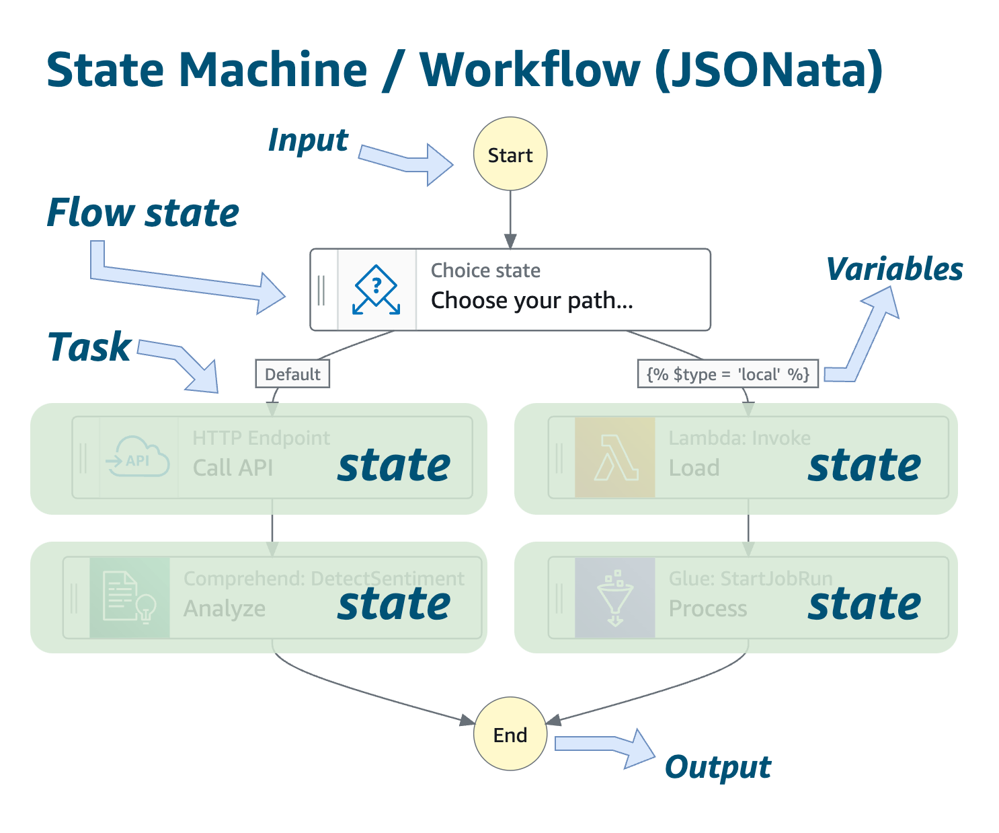
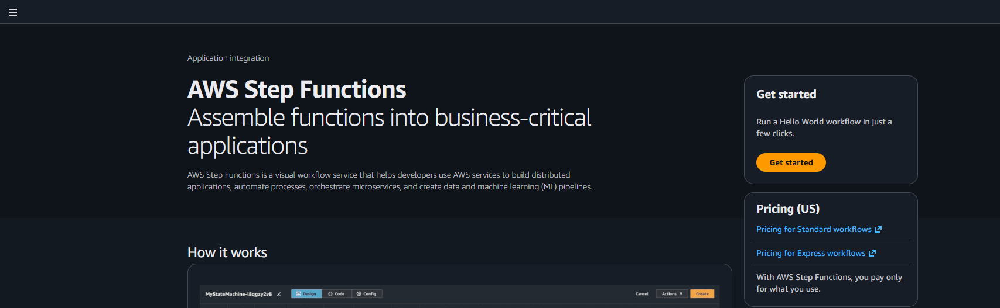
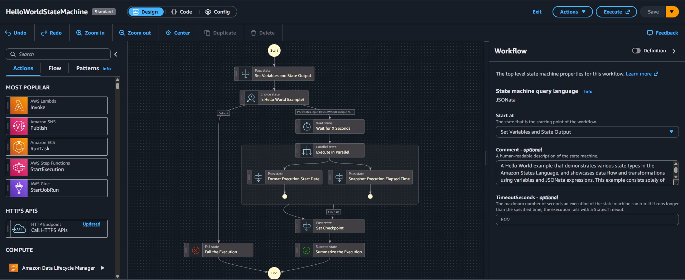

# DIO
Repositório para armazenar conhecimentos obtidos no curso DIO Santander Code Girls 2025 - Módulo Serviços Intermediários e Avançados.

# AWS Step Functions
Serviço serverless que permite criar fluxos de trabalho visuais e automáticos (workflows) que orquestram vários serviços da AWS. Ele coordena vários passos de um processo, na ordem certa, com condições, esperas, paralelismo e tratamento de erros - tudo isso através de uma interface visual (low-code).

O Step Functions é baseado em máquinas de estado (ou workflows), que são compostos por uma série de etapas orientadas por eventos.
Alguns possíveis casos de uso são: orquestrar tarefas, escolher tarefas baseados em um evento ou dado, processsar dados em paralelo e tratar erros.

Conceitos importantes:
- Input (entrada): é a informação de entrada que um estado recebe. Pode ser um evento inicial ou o output do estado anterior.
- State (estado): é uma etapa do fluxo. Pode ser, por exemplo, uma tarefa (task) ou um condicional (choice) que define qual será a próxima etapa.
- Task (tarefa): é o tipo de estado mais importante, onde uma ação concreta é realizada. Por exemplo, chamar AWS Lambda.
- Variables (variáveis): são referências dinâmicas que armazenam valores dentro do fluxo.
- Output (saída): resultado produzido por um estado, podendo ser utilizado como entrada pelo próximo estado.

# Criando um Workflow

- Busque por "step funcions" na barra de pesquisa e acesse o serviço.

- Selecione a opção "Get started" caso seja a primeira step funcion a ser criada.

- Caso contrário, aparecerá a lista de step funcions já criadas e a opção de criar um 'state machine' novo.

- Para a criação, escolha se deseja criar uma função do zero ou utilizar um dos templates disponibilizados pela AWS, nomeie a função, escolha o tipo (Standard é ideal para workflows longos e complexos e Express é ideal para eventos de larga escala e curtos) e clique em "Continue".

- A interface é composta pelas opções de estados a serem adicionados na esquerda, o fluxo montado no meio e propriedades e configurações de cada estado na direita.

- Após a criação, ela pode ser acessada para verificação de métricas de execução, definição, versões e outros detalhes referentas a função.

